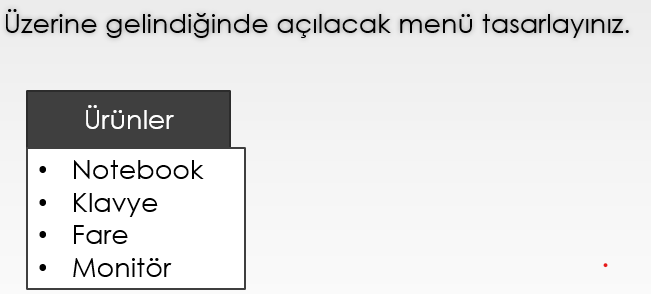
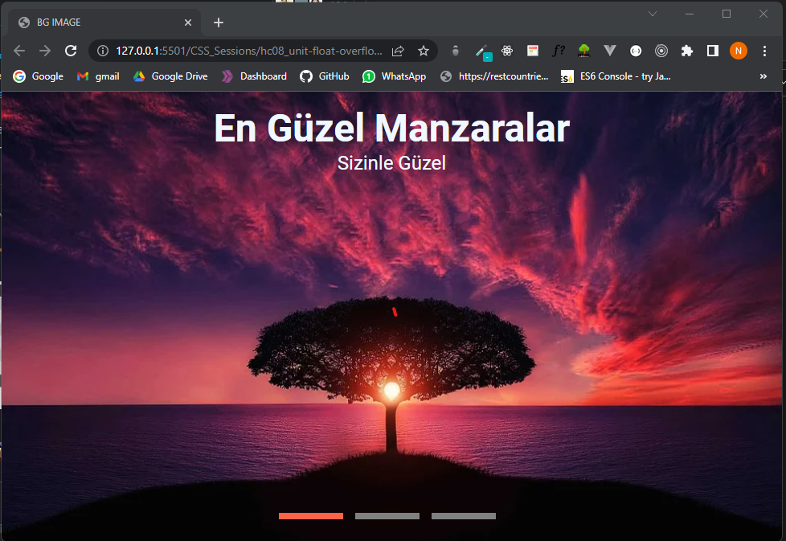
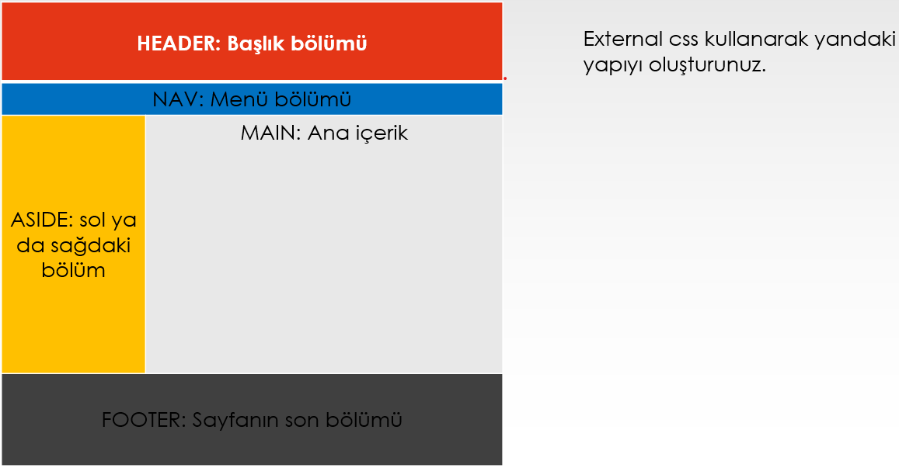

# ASSIGMENT-2

Klasörde ekran alıntıları gözüken 3 adet assigment'ı çarşamba gününe kadar yapmanızı rica ediyoruz :)

#BONUS Assigment
Canlısı aşağıdaki linkte görüleceği üzere netlify üzerinde deploy edilmiş bir site şablonu tasarlayabilirsiniz. Özellikle CSS position'ı kavramak için güzel bir örnek olacaktır.

https://site-position.netlify.app/

NOT1: Tarayıcının uzunluğunu küçülterek sayfayı aşağıya doğru scrool yaptığınızda turuncu navbar'a dikkatinizi çekerim.:)

NOT2: İsyenler yaptığı uygulamayı github vb bir yerde deploy edebilir.
