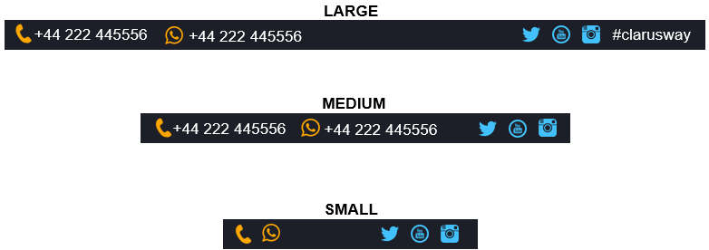

# ASSIGMENT-6 (Bootstrap)

## ODEV1:Aşağıdaki web tasarımlarını Boostrap ile yapınız.

- Sadece xs ekranlarda gözükecek bir element tasarlayınız.
- Sadece xs ekranlarda gözükmeyecek bir element tasarlayınız.
- Sadece md ekranlarda gözükecek bir element tasarlayınız.
- Sadece md ekranlarda gözükmeyecek bir element tasarlayınız.
- Sadece md+ ekranlarda gözükecek bir element tasarlayınız.

## ODEV2:Aşağıdaki görüldüğü gibi bir footer elemanını Boostrap ile yapınız.

## ODEV3:Aşağıda canlısı görülen Bootstrap projemizin starter dosyası eklenmiştir. Bu doğrultuda projeyi bootstrap kullanarak responsive olarak tasarlayınız.

https://bootstrap-cw.netlify.app/
